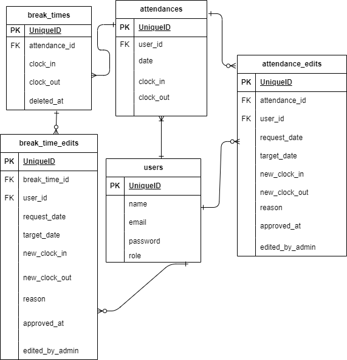

# tna-app1  

## 環境構築  
### Dockerビルド  
1. git clone git@github.com:coachtech-material/laravel-docker-template.git  
    mv laravel-docker-template tna-app1  
2. DockerDesktopアプリの立ち上げ  
3. docker-compose up -d --build  
### Laravel環境構築  
1. docker-compose exec php bash  
2. composer install  
3. .envに環境変数を追加  
    DB_HOST = mysql  
    DB_DATABASE=laravel_db  
    DB_USERNAME=laravel_user  
    DB_PASSWORD=laravel_pass  
4. アプリケーションキーの作成  
    php artisan key:generate  
5.  マイグレーションの実行  
    php artisan migrate  
6. シーディングの実行  
    php artisan db:seed 

## ユーザーのダミーデータ（管理者）  
    メールアドレス: dousan@gmail.com  
    パスワード : mamushinooyazi  
## ユーザーのダミーデータ  

1.  メールアドレス: asano@gmail.com  
    パスワード: naganaganaga  
2.  メールアドレス: cleo@gmail.com  
    パスワード: patrapatra
## メール認証  
1.  .envファイルに追加  
    MAIL_MAILER=smtp  
    MAIL_HOST=mailhog  
    MAIL_PORT=1025  
    MAIL_USERNAME=null  
    MAIL_PASSWORD=null  
    MAIL_ENCRYPTION=null  
    MAIL_FROM_ADDRESS=no-reply@example.com  
    MAIL_FROM_NAME="Tna App1"  
2. コンテナ再起動  
    docker-compose down
    docker-compose up -d  
## テスト  
1. テスト用データーベースの用意
    docker-compose exec mysql bash  
    mysql -u root -p  
    CREATE DATABASE demo_test;  
2. テスト用.envファイル作成と編集  
    $ cp .env .env.testing  
    APP_NAME=Laravel  
    APP_ENV=test  
    APP_KEY=  
    APP_DEBUG=true  
    APP_URL=http://localhost  
    (略)  
    DB_CONNECTION=mysql  
    DB_HOST=mysql  
    DB_PORT=3306  
    DB_DATABASE=demo_test  
    DB_USERNAME=root  
    DB_PASSWORD=root  
3.  テスト用アプリケーションキーの作成  
    php artisan key:generate --env=testing  
    php artisan config:clear  
4.  マイグレーション  
    php artisan migrate --env=testing

## URL  
- 開発環境：http://localhost/  

- phpMyAdmin:http://localhost:8080/  

- メール認証(MailHog): http://localhost:8025/  

## ER図  

  

## 使用技術（実行環境）  
- PHP7.4.9  
- Laravel8.83.29  
- MySQL8.0.26  
   